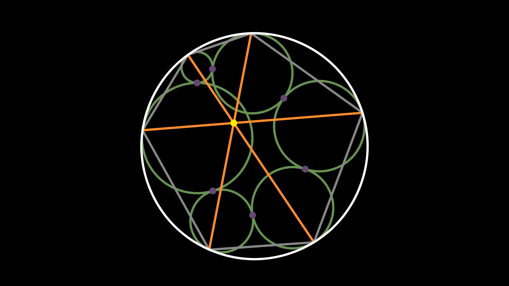

# The Seven-Circle-Theorem

This repository contains the source code for a video about the proof of the Seven-Circle-Theorem by [Drach und Schwartz](https://arxiv.org/pdf/1911.00161.pdf).
The video was created using [manim](https://github.com/ManimCommunity/manim).

The video is uploaded to [YouTube](https://youtu.be/flR3e5Cc2G4). The video is in German but English subtitles are available as well.

## Theorem 
For every chain H_1, ..., H_6 of consequently touching circles inscribed in and touching the unit circle the three main diagonals of the hexagon comprised of the points at which the chain touches the unit circle intersect at a common point.

